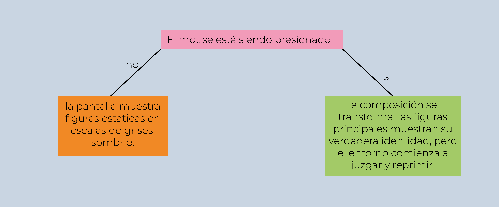

# Solemne 02

# Desarrollo de identidades de género en ambientes hostiles
**Autor: Héctor Inai Espinoza**

Este proyecto representa en un código de p5.js la dificultad de desarrollar y expresar una identidad de género que se escapa de lo cisgénero y heteronormado.

---

## ¿Qué se ve en la pantalla?

En la pantalla, al entrar, vemos 4 figuras grandes y grises en 4 esquinas del canvas, rodeadas por elipses que cambian de color entre tonos grises, con un texto que dice "haz click para expresarte". Cuando haces click, la pantalla se vuelve progresivamente roja, con líneas aleatorias por toda la pantalla, también ojos y bocas apareciendo y desapareciendo aleatoriamente por todo el canvas.
Las figuras también se mueven al hacer click, se transforman en una figura diferente mientras se glitchean.

---

## ¿Qué elementos visuales aparecen?

Aparecen elementos como elipses pequeñas en loop y 4 figuras en 4 esquinas del canvas; al hacer click aparecen líneas aleatorias e imágenes de ojos y bocas, también un glitch de formas.

---

## Descripción conceptual

La idea central de este proyecto es representar la opresión que pone la sociedad ante una expresión de género diferente a la común, por lo que al presionar el mouse, la presión encima de las figuras empieza a mostrarse.
La presión del mouse es el elemento importante en este sistema; al hacer click las figuras comienzan a "expresarse" y se revela la respuesta del entorno ante esta acción.

### ¿Cómo se relaciona este sistema con la problemática?
Las elipses en el fondo en tonos grises representan a una sociedad heteronormada que rodea a las 4 figuras principales, a las que al hacer click estamos permitiéndoles que se expresen. Al expresarse, cambian de forma a una que no es su original, pero junto a este cambio, el entorno de la sociedad comienza a tornarse rojo, lleno de furia y de ojos y bocas que critican, juzgan y oprimen. Los cuerpos principales se glitchean, representando la dificultad de expresarse libremente.

---

## Reglas que gobiernan el sistema

### 1. INPUT
* **mouseIsPressed:** La acción principal del usuario (Presionado / Suelto).
* **Imágenes:** Los archivos `ojo.png` y `boca.png` desde la memoria.
* **Tiempo:** El pulso constante del programa que corre a 50 fotogramas por segundo.

### 2. ¿Cómo se procesan y transforman?
* **Variable `ruido`:** Si presionas, el `ruido` sube (hasta 255); si sueltas, baja (hasta 0).
* **La Desaparición:** El sistema resta el ruido al valor máximo de opacidad, transformando la presión del mouse en un efecto de desvanecimiento gradual:
  text{Opacidad} = 255 - text{ruido}
* **Elipses de fondo `for`:** El loop procesa las coordenadas `X` e `Y` sumando de 25 en 25 píxeles para multiplicar un solo círculo en una cuadrícula multiplicada y alineada.
* **El Caos `random` y `rotate`:** El sistema muestra ángulos de rotación continuos y genera números al azar para desordenar posiciones, tamaños y colores.

### 3. ¿Qué respuesta visual producen? - OUTPUT
El sistema produce dos estados visuales opuestos:
* **ESTADO A (Sin Click - "El Camuflaje"):** El fondo es gris oscuro. Se ve una cuadrícula perfecta de mil círculos parpadeantes y un texto blanco que dice "haz click para que las figuras se expresen". En el centro, el individuo está representado por figuras grises, pacíficas e inmóviles.
* **ESTADO B (Con Click - "La Expresión"):** El fondo se tiñe de rojo. La cuadrícula de círculos y el texto desaparecen por completo. El individuo central estalla en colores psicodélicos y tiembla violentamente, mientras la pantalla es bombardeada por ojos, bocas y líneas de colores que giran de forma caótica.

---

## 2. Sistema de interactividad

La interactividad funciona como un bucle de tensión y liberación con dos estados:
* **Estado Pasivo (Sin Click):** El sistema invita al usuario con el texto "haz click para expresarte". El entorno es gris, ordenado y monótono. El individuo está camuflado, quieto y en silencio dentro de una estructura rígida (los círculos).
* **Estado Activo (Con Click):** Al presionar, el usuario desata una transformación gradual. El fondo se vuelve rojo, la cuadrícula opresora se borra y el individuo rompe la norma: estalla en colores, tiembla violentamente y el lienzo es bombardeado por líneas de interferencia, ojos y bocas. Al soltar el mouse, el sistema se drena y regresa de inmediato al orden inicial.



---
# Codigo P5.js

```javascript
// variables declaradas
let ruido = 0;
let r, g, b;
let rotacion = 0;
let ojo, boca;

function setup() {
  createCanvas(800, 800); // tamaño canvas
  frameRate(50); // velocidad de los frames
}

function preload() { // función para cargar las imágenes en el código y poderlas usar a lo largo de este
  ojo = loadImage("ojo.png");
  boca = loadImage("boca.png");
}

function draw() {
  // declaración de todas las funciones
  fondo();
  fotos();
  sociedad();
  glitch();
  figuras();
  texto();
}

function fondo() {
  if (mouseIsPressed) { // condicional "si presiono el mouse"
    ruido = ruido + 2; // si el mouse se presiona, a "ruido" se le suman 2 en cada frame
  } else { // condicional "si no se presiona el mouse"
    ruido = ruido - 4; // si el mouse no se está presionando, a "ruido" se le restará 4 cada frame
  }
  ruido = constrain(ruido, 0, 255); // constrain sirve para declararle límites a las operaciones de "ruido", sin este "ruido" sumará o restará infinitamente
  background(28 + ruido, 28, 28); // da el color gris al fondo, pero como el R está sumado con "ruido", al presionarlo este 28 subirá.
}

function fotos() {
  if (mouseIsPressed) {
    tint(255, ruido); // da tinte a las imágenes; en este caso está con los tintes RGB al 255 y no varía, pero sí la opacidad que depende del "mouseIsPressed" y de "ruido"
    let fotos = random(100); // en esta variable se declara un random con máximo de 100, para que nos dé números aleatorios del 0 al 100
    let tamanoFotos = random(40, 300); // variable que nos permitirá darle tamaños aleatorios a las imágenes.
    if (fotos < 50) { // condicional "si" la variable "fotos" nos da un número menor o igual a 50, nos pondrá la imagen "ojo"
      image(
        ojo,
        random(0, width - tamanoFotos), // posición de la imagen en "random" con el mínimo 0 y máximo el ancho del canvas.
        random(0, height - tamanoFotos), // posición de la imagen en "random" con el mínimo 0 y máximo el alto del canvas.
        tamanoFotos, // tamaño de la imagen aleatorio
        tamanoFotos
      );
    } else { // condicional "si fotos" nos da un número mayor a 50, nos pondrá la imagen "boca"
      image(
        boca,
        random(0, width - tamanoFotos),
        random(0, height - tamanoFotos),
        tamanoFotos,
        tamanoFotos
      );
    }
    noTint(); // cierre del uso del tinte
  }
}

function sociedad() {
  for (let x = 0; x <= width; x = x + 25) { // automatización de las elipses en x
    for (let y = 0; y <= height; y = y + 25) { // automatización de las elipses en y
      let personasGrises = random(255); // variable que declara color aleatorio pero en escala de grises.
      fill(personasGrises, 255 - ruido); // relleno de las elipses con la variable "personasGrises" y la opacidad que se resta progresivamente de acuerdo al mouseIsPressed de "ruido"
      noStroke(); // elipses sin borde
      ellipse(x, y, 15); // creación de la elipse
    }
  }
}

function glitch() {
  if (mouseIsPressed) {
    r = random(50); // variable que declara aleatoriedad a R de 0 a 50
    g = random(50); // variable que declara aleatoriedad a G de 0 a 50
    b = random(255); // variable que declara aleatoriedad a B de 0 a 255
    push();
    rotacion = rotacion + 1; // variable que declara suma a la rotación
    rotate(rotacion); // función de rotar
    stroke(r, g, b); // línea en colores random gracias a las variables r, g y b
    line(0, random(0, 800), 800, random(0, 800)); // creación de líneas
    line(0, random(0, 800), 800, random(0, 800));
    line(random(0, 800), 0, 800, random(0, 800));
    line(0, random(0, 800), random(0, 800), random(0, 800));
    line(0, random(0, 800), random(0, 800), 0);
    line(random(0, 800), 800, 800, random(0, 800));
    pop();
  }
}

function figuras() {
  rectMode(CENTER); // posiciona las figuras desde el centro en vez de la esquina superior izquierda

  if (mouseIsPressed) { // condicional "si" el mouse se presiona, las figuras aleatorias de colores aparecen
    fill(random(255), random(255), random(255));
    noStroke();
    rect(600 + random(-15, 15), 600 + random(-15, 15), 100, 120);
    circle(200 + random(-15, 15), 600 + random(-15, 15), 90);
    triangle(
      600 + random(-15, 15),
      150 + random(-15, 15),
      550,
      250 + random(-15, 15),
      650,
      250 + random(-15, 15)
    );
    ellipse(200 + random(-15, 15), 200 + random(-15, 15), 70, 100);
    rect(200 + random(-25, 25), 200 + random(-25, 25), 70, 60);
  } else { // variable "si el mouse no se apreta", las figuras estáticas aparecen
    noStroke();
    fill(35);
    rect(200, 200, 80, 80);
    circle(600, 200, 80);
    triangle(200, 550, 150, 650, 250, 650);
    ellipse(600, 600, 70, 100);
  }
}

function texto() {
  fill(255, 255 - ruido);
  textSize(24); // tamaño del texto
  textAlign(CENTER);
  noStroke();
  text("haz click para que las figuras se expresen", 400, 750); // creación del texto
}
```
---

[Link P5.js](https://editor.p5js.org/ekkkt0r/sketches/mfg8rmYoM)
